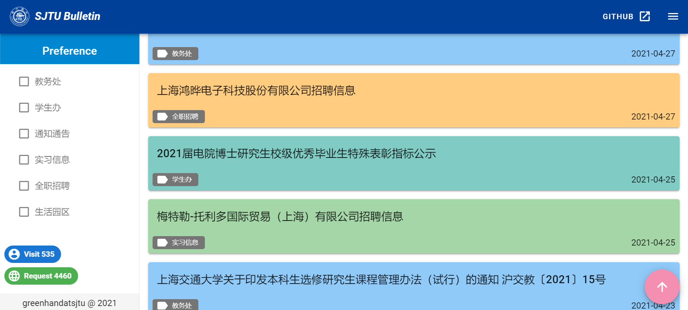
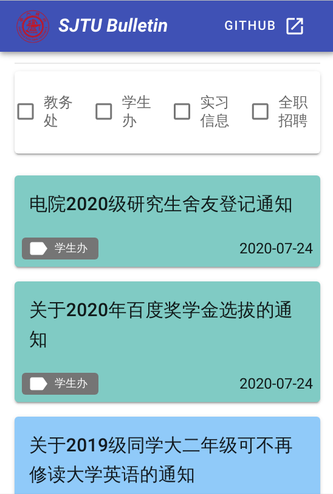

# SJTU-bulletin
SJTU SEIEE Bulletin. 上海交大公告栏

## 介绍

SJTU-bulletin是一个聚合类web app，爬取[教务处](http://jwc.sjtu.edu.cn/web/sjtu/198076.htm)、[电院学生办](http://xsb.seiee.sjtu.edu.cn/xsb/list/705-1-20.htm)、[实习信息](http://xsb.seiee.sjtu.edu.cn/xsb/list/2496-1-20.htm)、[全职招聘](http://xsb.seiee.sjtu.edu.cn/xsb/list/2495-1-20.htm)、[交大官网通知通告](https://www.sjtu.edu.cn/tg/index.html)和[生活园区通知](http://ourhome.sjtu.edu.cn/news)等网页的通知，最终展示在一个网页上，方便、及时。

网址：https://lokuman.me （已支持PWA）

### 技术栈

+ 爬虫：`Scrapy`+`sqlite`
+ 前端：`Vue`+`Vuetify`
+ 后端：`Go`+`Echo`+`Gorm`

## 使用方法

首先进入`crawler`文件夹，安装依赖：

```bash
pip install -r requirements.txt
```

接着将`bulletin.db.example`复制到`bulletin.db`

然后爬取通知：

```bash
scrapy crawl notice
```

接下来进入`frontend`文件夹，先安装依赖：

```bash
npm install
```

接下来编译：

```bash
npm run build
```

最后回到项目根目录，运行服务器：

```bash
GO111MODULE=on go build -o server main.go
./server -d=true
```

使用浏览器访问`http://localhost:8080`

## 截图

|          桌面端          |        移动端         |
| :----------------------: | :-------------------: |
|  |  |

## TODO

+ [x] 新增交大官网通知通告、生活园区通知
+ [x] `crontab`定时爬取
+ [ ] dockerize
+ [x] 分页
+ [ ] ~~自动删除旧通知，防止数据库过大~~
+ [ ] ~~页面cache~~
+ [x] 实现TapToTop
+ [x] 实现记录、统计访客和请求
+ [x] 重新适配教务处 http://www.jwc.sjtu.edu.cn/xwtg/tztg.htm
