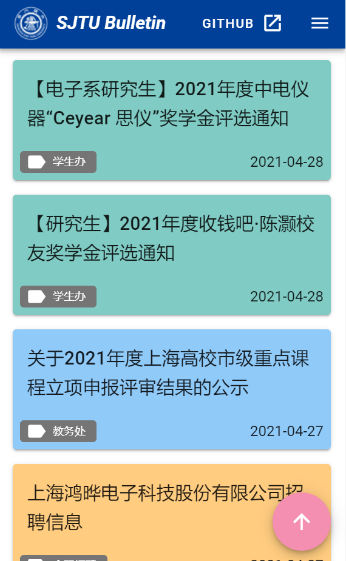

# SJTU-bulletin
SJTU SEIEE Bulletin. 上海交大电院公告栏

## 介绍

SJTU-bulletin是一个聚合类web app，爬取教务处、电院学生办、实习信息和全职招聘4个网页的通知，最终展示在一个网页上，方便、及时。

网址：http://120.79.202.172:12345/

### 技术栈

+ 爬虫：`Scrapy`+`sqlite`
+ 前端：`Vue`+`Vuetify`
+ 后端：`Go`+`Echo`+`Gorm`

## 使用方法

首先进入`crawler`文件夹，安装依赖：

```bash
pip install -r requirements.txt
```

接着将`bulletin.db.example`重命名为`bulletin.db`

然后爬取通知：

```bash
scrapy crawl notice
```

接下来进入`frontend`文件夹，先安装依赖：

```bash
npm install
```

接下来编译：

```bash
npm run build
```

最后回到项目根目录，运行服务器：

```bash
GO111MODULE=on go build -o server main.go
./server -d=true
```

使用浏览器访问`http://localhost:8080`

## 截图




## TODO

+ [ ] `crontab`定时爬取
+ [ ] dockerize
+ [ ] 分页
+ [ ] 自动删除旧通知，防止数据库过大
+ [ ] 页面cache
